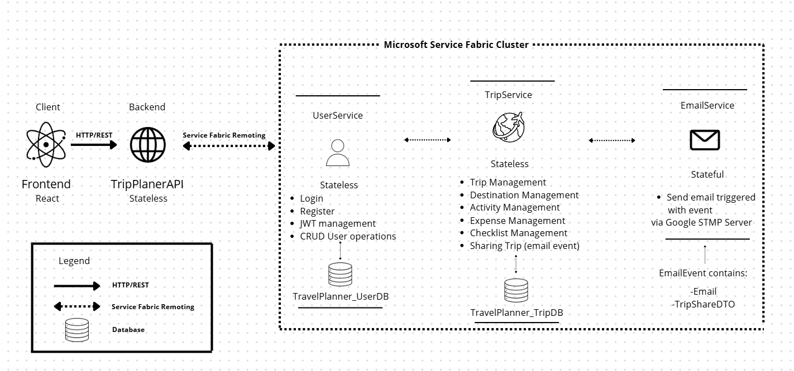
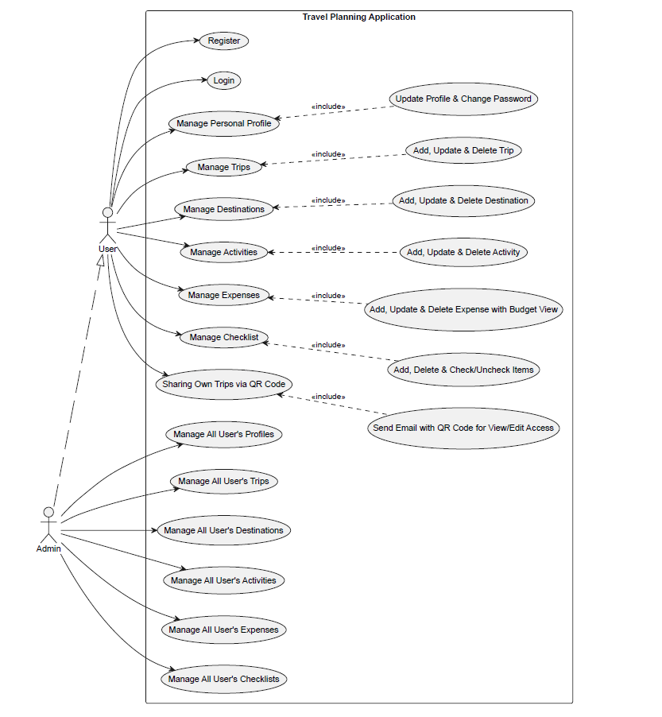

# TripPlanner — Travel Planning Web Application

A modern informational web system designed to help users organize, schedule, and visually track their travel itineraries, budgets, packing lists, and shared plans.

This project was developed for the course **"Application of Web Programming in Infrastructure Systems"** at the **Faculty of Technical Sciences (FTN)**.

---

## 🏗️ System Architecture & Microservices

The application is built on top of a highly scalable **Microservices Architecture** hosted inside a **Microsoft Service Fabric** environment, backed by **Microsoft SQL Server**.

### 📊 Use Case Diagram

### Service Fabric Cluster Services

1. **UserService (Stateless)**
   * Handles user authentication, registration, secure password hashing (`BCrypt`), and Role-Based Access Control (`User` / `Admin`).
   * Generates and validates `JWT` bearer tokens.
   * **Database:** `TravelPlaner_UserDB` (SQL Server).

2. **TripService (Stateless)**
   * Central core managing trip configurations, destinations, calendar-view daily activities, and real-time expense/budget calculation.
   * Triggers asynchronous `EmailEvent` payloads to the `Email` when sharing trip access
   * Downloading PDF with all informations for the trip
   * **Database:** `TravelPlaner_TripDB` (SQL Server).

4. **EmailService (Stateful)**
   * Processes incoming automated mail transmissions by executing asynchronous `EmailEvent` tasks.
   * Uses an internal `EmailEvent Queue` to process messages concurrently via a dedicated background worker, shipping emails over Google SMTP using `MailKit`.
   * Delivers external QR codes providing `VIEW` or `EDIT` tokens.

---

## 🛠️ Technical Stack

* **Frontend:** React, TypeScript, Tailwind CSS, Axios, React Router, jwt-decode.
* **Backend Gateway & Framework:** ASP.NET Core WebAPI Gateway, Microsoft Service Fabric, Entity Framework Core.
* **Databases:** Microsoft SQL Server (Docker Containerized).

---

## 📦 Getting Started & Local Setup

### 1. Initializing the Database Environment
The databases run inside a containerized MSSQL environment.
Open Package Manager Console in Visual Studio, select the desired microservice project as both the Default Project and Startup Project, then execute:

Update-Database

This applies all existing Entity Framework Core migrations to the corresponding database.
### 2. Running the Infrastructure Backend

Start your Service Fabric Local Cluster Manager (Run as Administrator) and initialize it in either 1-Node or 5-Node layout.

Open the complete backend solution files within Visual Studio 2022 (as Administrator).

Set your central Service Fabric Application project (TravelPlannerApp) as your Startup Project and press F5.

### 3. Running the React Frontend

Open a terminal and navigate to the frontend directory:

cd Frontend

Install all required dependencies:

npm install

Start the development server:

npm run dev
